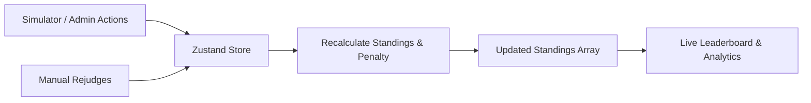

# CodeChef Contest Control Center

Hey there! This is the repository for the **CodeChef Contest Control Center**, a real-time simulated dashboard built for contest organizers to monitor and run competitive programming events. It's designed to give admins complete control over standings, rejudging, and freeze/thaw states on the fly.

---

* **Control Center**: https://controlcc.vercel.app/
---

## 📸 Screenshots

### 1. Operations Control Deck Overview
* Dark Mode :


* Light Mode :


### 2. Standings Frozen Mode


### 3. Timeline Rewind & Autoplay Controls


https://github.com/user-attachments/assets/42d58d1d-7cae-4a4e-bcf9-99ff3d5a574d


### 4. Plagiarism Detection & Security Scanner


### 5. Contest Analytics & Graphs


### 6. Participant Registry & Filter Management


### 7. Live Submission Stream


### 8. Persistent User Account Registration & Unified Passcode Lock


### 9. Interactive Analytics & Graph Detailed Drilldown


### 10. Interactive "What-If" Rank Predictor


Uploading 20260628-1642-02.3922367.mp4…


---


## 🛠️ The Tech Stack

I kept things modular and performant:
* **Next.js 16 (App Router)**: My core framework for page routing and layout structure.
* **Zustand**: Hands down the easiest way to handle shared state. It syncs automatically with `localStorage` so everything stays intact if you refresh.
* **Framer Motion**: Handles row re-ordering animations on the leaderboard, the safety cover switch, and particle explosions on first-bloods.
* **Recharts**: Powers the operational charts (submission timelines, language combat graphs, etc.).
* **Vanilla CSS**: Clean variables and custom animations without relying on bulky tailwind setups.
* **Lucide React**: Clean icons for widgets.

---

## 📂 Project Layout

Here is a quick look at where everything is:

```
src/
├── app/
│   ├── globals.css         # Styling variables (light/dark theme), custom scrollbars, animations
│   ├── layout.tsx          # Font loading and core HTML wrapping
│   └── page.tsx            # Main page - controls the loader and mounts the grid
├── components/
│   ├── DashboardGrid.tsx   # Manages widget ordering, timeline rewind, confetti, and toast popups
│   ├── CountdownDial.tsx   # Timer dial, light/dark theme switch, safety lock cover, standings freeze
│   ├── OverviewStats.tsx   # Quick KPI cards (active users, success rates, etc.)
│   ├── Leaderboard.tsx     # The CP leaderboard with visual indicators (streaks, active simulation highlights)
│   ├── Submissions.tsx     # Scrollable list of submissions with filters
│   ├── ParticipantTable.tsx# Table list of participants with search, sorting, and paging
│   ├── SecurityPanel.tsx   # Logs suspected duplicate code and allows manual disqualifications
│   ├── ActivityFeed.tsx    # Live feed of dashboard actions and events
│   ├── AnalyticsPanel.tsx  # Charts panel mapping submission stats and language popularity
│   ├── RejudgeModal.tsx    # Pop-up modal allowing admins to override submission verdicts
│   ├── BorderGlow.tsx      # Hover-glow card wrapper component
│   └── CubeLoader.tsx      # Solves-themed loading screen
├── store/
│   └── useContestStore.ts  # Zustand store that handles rankings logic, undo actions, and state changes
├── hooks/
│   └── useContestSimulator.ts # Simulates random participants joining and submitting code
└── utils/
    └── mockData.ts         # Preloaded problem sets, submissions, and participants
```

---

## 🧠 How I Handle State

Instead of overcomplicating things with Redux or Prop Drilling, I went with **Zustand**. 

Everything is driven by a single store (`useContestStore.ts`). Every time a participant submits a solution, or an admin changes a verdict:
1. The store catches the change.
2. It triggers the standings engine to recalculate ranks and penalty times.
3. Ranks are sorted: **Solved Problems** (descending) ➔ **Penalty Time** (ascending) ➔ **Alphabetical** (as a stable tie-breaker).
4. Disqualified participants are automatically flagged and pushed to the absolute bottom of the rankings.

**Side-Effect Free Features:**
For things like the **Timeline Rewind** and **Leaderboard Sandbox**, I have avoided writing back to the store. Instead, I computed the state inside components (e.g. filtering submissions dynamically by timestamp or injecting a simulated row). This ensures you can play around with simulations and rewinds without corrupting the live-running simulation.

---

## 🔄 The Data Flow



### Freeze & Thaw Workflow
* Toggling the freeze mode captures a deep copy of the standings at that moment.
* While frozen, the leaderboard displays this snapshot with a frosted glass visual overlay. Submissions continue streaming in the background, but the rankings do not change.
* Thawing the contest releases the snapshot, immediately updating the rankings and animating rows to their new positions.

---

## 💡 Assumptions Made

1. **Duration**: Default duration is set to 90 minutes. However, admins can change this at any time using the edit dial in the header.
2. **Mock Data Range**: The preloaded submission data spans up to minute 135. The timeline rewind slider dynamically adjusts its maximum limit to match either the elapsed time or the configured contest time.
3. **Plagiarism Matches**: Two submissions are flagged if they share the exact same timestamp, problem code, programming language, execution runtime, and verdict, but belong to different users.

---
